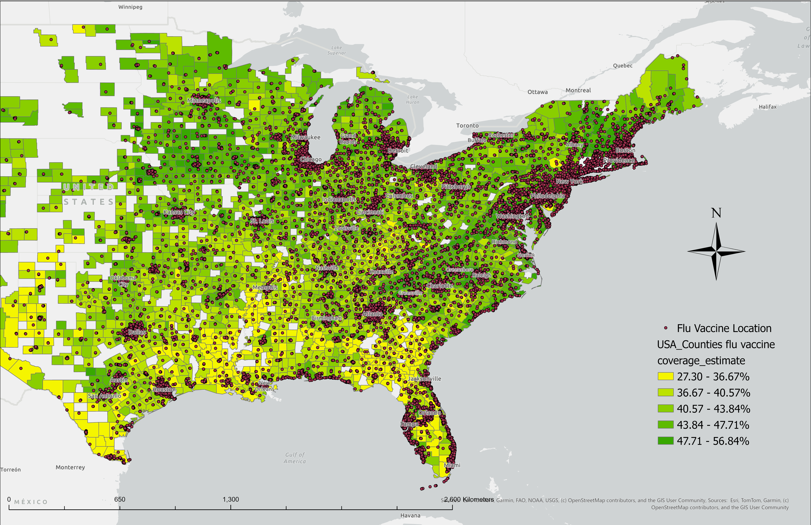
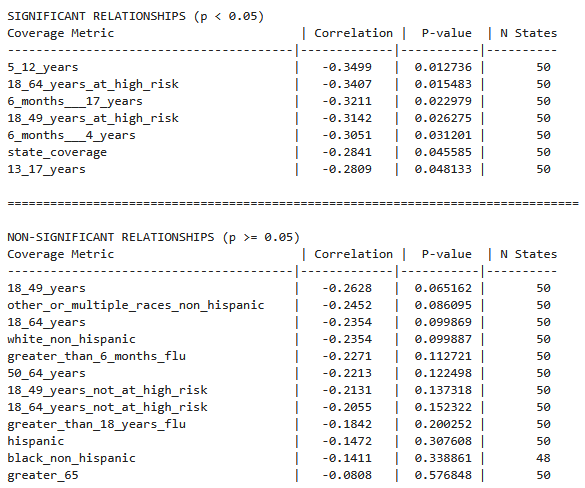
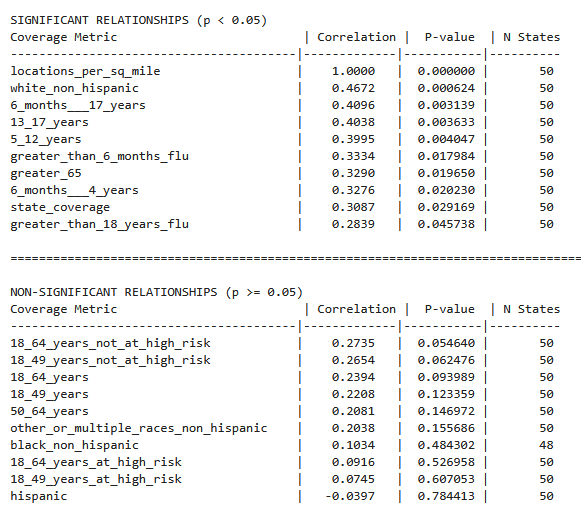
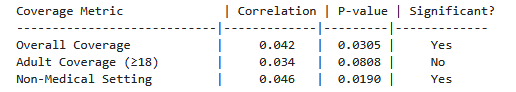
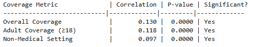

# Flu Vaccination Provider Density Analysis

Investigating the relationship between flu vaccine provider density and vaccination rates across U.S. states and counties. 

Data was taken from two CDC API's, one containing information about vaccine distribution centers, and the other containing information about vaccination rate accross various geographic and demographic groups.


**ArcGIS map depicting recorded vaccination locations in the eastern United States**

## Key Findings

- Positive relationship between number of providers per square mile and estimated vaccination rate overall of states and counties as well as most population dimensions.
- Little to negative relationship between provider locations per 1000 people and estimated vaccination coverage accross state and county.
- Younger and older individual estimated vaccination rates are impacted much more by the density of vaccine providers.
- Minority groups such as hispanic and non-hispanic as well as high-risk individuals seem to be less affected by provider density and have inconsistent results.
- It is much more effectvie to add vaccination sites in places with low physical coverage density rather than a lack of locations per person. 

## Background

The CDC publishes weekly flu vaccination rates for every state and many counties, alongside a comprehensive database of ~202k flu vaccine providers nationwide that was upkept until 2024. 
The main research question is whether or not areas with more vaccination sites will havea increased vaccination rates, and if so, how does this difference appear in different demographic groups.
The purpose of thise questioning is to determine whether or not increasing the number of vaccination cites is an effective way of increasing seasonal flu vaccination rate, or whether other efforts such as 
public health awareness campaigns, science education, or more targetted approaches would be useful. 

**Research Question**: Does vaccination site density at the state or county level correlate with higher flu vaccination coverage for those areas. 

## Data Sources

- **CDC Flu Vaccinating Provider Locations** (July 2024): 202k provider records
  - API: https://data.cdc.gov/Flu-Vaccinations/Vaccines-gov-Flu-vaccinating-provider-locations/bugr-bbfr/about_data
- **CDC Influenza Vaccination Coverage** (Jan 2025): 220k coverage records  
  - API: https://data.cdc.gov/Flu-Vaccinations/Influenza-Vaccination-Coverage-for-All-Ages-6-Mont/vh55-3he6/about_data
- **US Census Data (2022 ACS 5-year)**: County population estimates via `censusdata` library
- **TIGER shapefile for Counties**: County area used to calculate provider locations per square mile.
  - Acquired from: https://www2.census.gov/geo/tiger/TIGER2024/COUNTY/
## Methodology

1. **Data Collection**: Retrieved datasets via CDC Socrata API
2. **Data Processing**: 
   - Filtered coverage data to 2023-2024 season, month 12 (annual totals)
   - Mapped provider ZIP codes to counties for geographic aggregation
   - Calculated vaccination rates by state and county
   - Aggregated all county information accross multiple datasets using FIPS or Federal Information Processing Standards code
3. **Feature Engineering**: Created "providers per 1,000 people" and "providers per square mile" metric using imported Census population data and geopandas/us library geogrpahic data
4. **Statistical Analysis**: Pearson correlations between provider density and vaccination rates
5. **Robustness Testing**: Analyzed across multiple demographic breakdowns (age groups, race/ethnicity, risk categories)

## Results & Analysis
To examine whether the number of vaccination locations per 1,000 people and locations per square mile are related to vaccine coverage across states I calculated the Pearson correlation coefficient for each coverage metric.

The Pearson correlation measures the strength and direction of a linear relationship between two numeric variables:
- A positive correlation indicates that higher location density is associated with higher coverage.
- A negative correlation indicates that higher location density is associated with lower coverage.
- A correlation near zero suggests no linear relationship.

For each correlation, I also calculated a p-value to test whether the observed relationship is statistically significant (p < 0.05). Significant correlations indicate that the relationship is unlikely to have occurred by chance.

In my providers per 1000 people state analysis, some age and risk groups showed significant negative correlations, suggesting that higher location density alone does not guarantee higher coverage. This highlights that other factors — such as demographics, vaccine hesitancy, or accessibility barriers — may also influence vaccination rates. Population groups such as young people and overall state coverage were found to have significantly negative correlation with the provider location per population metric.

**State flu vaccine provider locations per 1000 people relationship with estimated state vaccination coverage**



State providers per square mile analysis yielded much better results, yielding positive correlations and low p-values when testing the relationship between provider density and estimated vaccination rate over almost all population dimensions. This finding means that states with a higher number of vaccine provider locations per square mile are correlated significantly with higher vaccination rates. When looking to increase the seasonal flu vaccination rates for a state, it is probably best to look at the location density rather than the number of people those locations are able to serve. It is a bit counter intuitive, but adding more vaccine provider locations in populous areas may not be that effective. A comparison of the number of locations over a number of years could help untangle this relationship, but this CDC provider data is limited to 2024. 

**State flu vaccine provider locations per square mile relationship with estimated state vaccination coverage**



On a county level, the results showed a positive correlation between vaccination rate over the 3 population metrics I looked at and vaccine provider locations per 1000 people and per square mile. Both comparisons had a very strong p-valie, but comparitively weaker correlation values, with the area comparison showing the highest among all available groups. This suggests that counties are more heterogenous than states and that other factors may play a more important role on the small scale. 

**County flu vaccination locations per 1000 people relationship with estimated county vaccination coverage**



**County flu vaccination locations per square mile relationship with estimated county vaccination coverage**



It is worth noting that the vaccination estimations and number of providers per county is a different part of each dataset, and it is possible that there are many counties with incomplete data. It is probably useful to view counties in relationship with one another, including factors such as rural vs urban, political affliation, education and employment. It is entirely likely that the descripency between counties similar in these facets will result in a more obvious relationship between provider location numbers. Nonetheless, there is a definite and repeatedly shown relationship between the density of providers and the vaccination rate of a county.

## Conclusions & Recommendations

**For Public Health Policy:**
- **Focus on low provider density areas**: It will be more effective to add vaccination locations in areas of low density, aka locations per square mile.
- **Focus on effective population sectors**: Children and people greater than 65 are the most impacted by provider density, so it would make sense to look at adding locations to places with a greater number of these constituencies.
- **Focus on demand-side strategies**: Address vaccine hesitancy, awareness, and convenience barriers. There are many more factors involved in flu vaccine uptake than number of providers.
- **Investigate similar counties and smaller geographic areas**: Comparing counties that are more similar may strengthen the density-coverage relationship. Additionally, more precise analysis may be done with access to data detailing coverage estimates in smaller geographic areas such as cities.

**For Healthcare Systems and CDC:**
- Investigate other factors driving vaccination rates (accessibility, trust, messaging)
- Try to keep vaccine provider location data updated
- Expand estimated coverage data to include city estimates.

### Requirements
```
pandas>=1.5.0
numpy>=1.24.0
matplotlib>=3.7.0
seaborn>=0.12.0
scipy>=1.10.0
requests>=2.28.0
censusdata>=1.15.0
```

### Running the Analysis
1. Clone this repository
2. Install requirements: `pip install -r requirements.txt`
3. Extract data files: `unzip data/processed_data.zip -d data/`
4. Run notebooks in order:
   - `api_data_scraping.ipynb` - Data collection from CDC APIs
   - `data_cleaning.ipynb` - Data processing and feature engineering  
   - `state_county_hypothesis_tests.ipynb` - Statistical analysis and visualizations

### Project Structure
```
├── notebooks/          # Analysis notebooks
├── data/
│   ├── raw/           # Original datasets
│   └── processed/     # Cleaned data (zipped)
├── visualizations/    # Key plots
└── README.md
```
