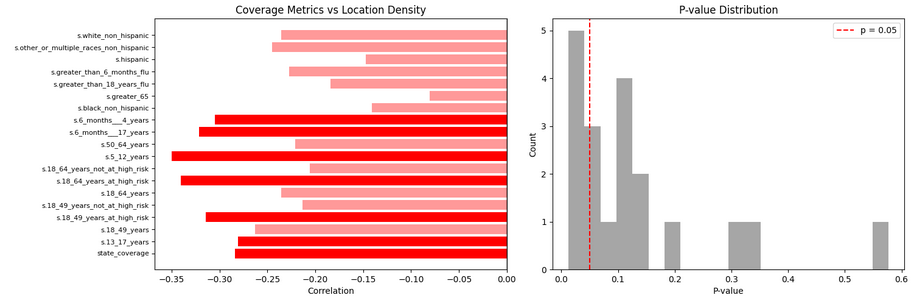
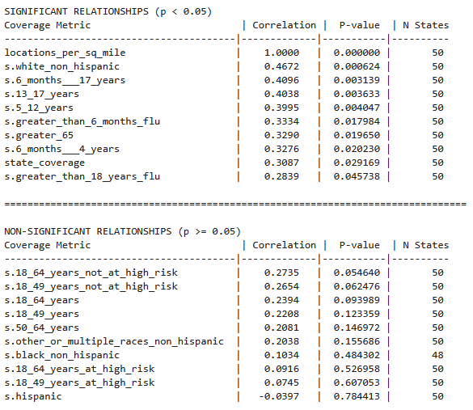

# Flu Vaccination Provider Location Analysis

Investigating the relationship between flu vaccine provider density and vaccination rates across U.S. states and counties. 

Data was taken from two CDC API's, one containing information about vaccine distribution centers, and the other containing information about vaccination rate accross various geographic and demographic groups.

## Key Findings

- Positive relationship between number of providers per square mile and estimated vaccination rate overall of states and counties as well as most population dimensions.
- Little to negative relationship between provider locations per 1000 people and estimated vaccination coverage accross state and county.
- Younger and non-at-risk individuals estimated vaccination rates are impacted much more by the density of vaccine providers.
- Minority groups such as hispanic and non-hispanic as well as high-risk individuals seem to be less affected by provider density. 

## Background

The CDC publishes weekly flu vaccination rates for every state and many counties, alongside a comprehensive database of ~202k flu vaccine providers nationwide that was upkept until 2024. 
The main research question is whether or not areas with more vaccination sites will havea increased vaccination rates, and if so, how does this difference appear in different demographic groups.
The purpose of thise questioning is to determine whether or not increasing the number of vaccination cites is an effective way of increasing seasonal flu vaccination rate, or whether other efforts such as 
public health awareness campaigns, science education, or more targetted approaches would be useful. 

**Research Question**: Does vaccination site density at the state or county level correlate with higher flu vaccination coverage for those areas. 

## Data Sources

- **CDC Flu Vaccinating Provider Locations** (July 2024): 202k provider records
  - API: https://data.cdc.gov/Flu-Vaccinations/Vaccines-gov-Flu-vaccinating-provider-locations/bugr-bbfr/about_data
- **CDC Influenza Vaccination Coverage** (Jan 2025): 220k coverage records  
  - API: https://data.cdc.gov/Flu-Vaccinations/Influenza-Vaccination-Coverage-for-All-Ages-6-Mont/vh55-3he6/about_data
- **US Census Data (2022 ACS 5-year)**: County population estimates via `censusdata` library

## Methodology

1. **Data Collection**: Retrieved datasets via CDC Socrata API
2. **Data Processing**: 
   - Filtered coverage data to 2023-2024 season, month 12 (annual totals)
   - Mapped provider ZIP codes to counties for geographic aggregation
   - Calculated vaccination rates by state and county
3. **Feature Engineering**: Created "providers per 1,000 people" metric using Census population data
4. **Statistical Analysis**: Pearson correlations between provider density and vaccination rates
5. **Robustness Testing**: Analyzed across multiple demographic breakdowns (age groups, race/ethnicity, risk categories)

## Results & Analysis
To examine whether the number of vaccination locations per 1,000 people and locations per square mile are related to vaccine coverage across states I calculated the Pearson correlation coefficient for each coverage metric.

The Pearson correlation measures the strength and direction of a linear relationship between two numeric variables:
A positive correlation indicates that higher location density is associated with higher coverage.
A negative correlation indicates that higher location density is associated with lower coverage.
A correlation near zero suggests no linear relationship.

For each correlation, I also calculated a p-value to test whether the observed relationship is statistically significant (p < 0.05). Significant correlations indicate that the relationship is unlikely to have occurred by chance.

In my providers per 1000 people state analysis, some age and risk groups showed significant negative correlations, suggesting that higher location density alone does not guarantee higher coverage. This highlights that other factors — such as demographics, vaccine hesitancy, or accessibility barriers — may also influence vaccination rates.



At the county level there were only three delineating metrics: overall coverage, adult coverage and non-medical coverage. This was due to the nature of the county data in the vaccine locations dataset. These results were also similar, showing little negative correlation between the number of vaccination locations per 1000 people.

State providers per square mile analysis yielded much better results, yielding positive correlations and low p-values when testing the relationship between provider density and estimated vaccination rate over almost all population dimensions.



### State-Level Analysis
- Sample: 50 states + DC
- Correlation: -0.2841
- P-value: 0.045585
- Effect size: 8.1%

### County-Level Analysis  
- Sample: 1369 counties with complete data
- Correlation: 0.017
- P-value: 0.5179
- Effect size: 0.02%

### Demographic Subgroup Analysis
Tested 18 different population segments:
- Mean correlation: -0.319
- Range: -0.3499 to -0.0808

## Conclusions & Recommendations

**For Public Health Policy:**
- **Avoid supply-side interventions**: Adding more vaccination sites is unlikely to increase uptake
- **Focus on demand-side strategies**: Address vaccine hesitancy, awareness, and convenience barriers
- **Resource allocation**: Redirect resources from site expansion to education and outreach programs

**For Healthcare Systems:**
- Optimize existing site utilization rather than expanding locations
- Investigate other factors driving vaccination rates (accessibility, trust, messaging)

## Technical Details

### Requirements
```
pandas>=1.5.0
numpy>=1.24.0
matplotlib>=3.7.0
seaborn>=0.12.0
scipy>=1.10.0
requests>=2.28.0
censusdata>=1.15.0
```

### Running the Analysis
1. Clone this repository
2. Install requirements: `pip install -r requirements.txt`
3. Extract data files: `unzip data/processed_data.zip -d data/`
4. Run notebooks in order:
   - `01_data_scraping.ipynb` - Data collection from CDC APIs
   - `02_data_cleaning.ipynb` - Data processing and feature engineering  
   - `03_analysis.ipynb` - Statistical analysis and visualizations

### Project Structure
```
├── notebooks/          # Analysis notebooks
├── data/
│   ├── raw/           # Original datasets
│   └── processed/     # Cleaned data (zipped)
├── visualizations/    # Key plots
└── README.md
```
